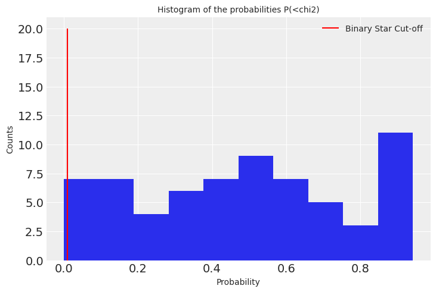
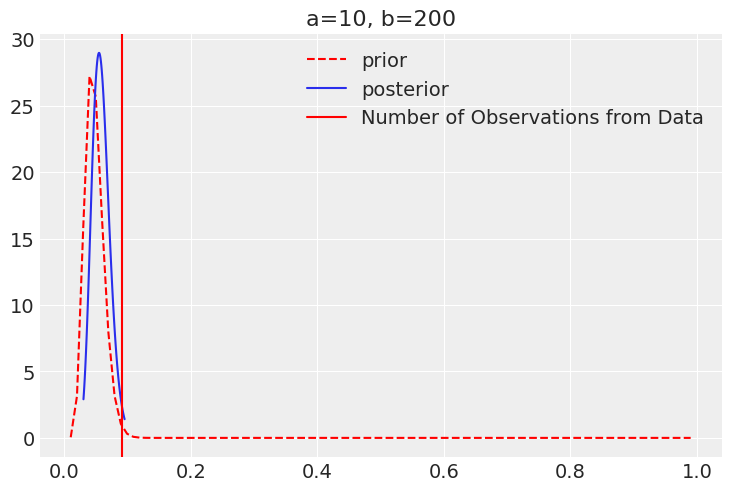
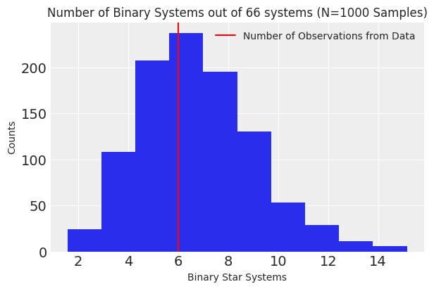

## Fraction of Binary stars in NGC 5053  

  

The project aims at identifying the fraction of binary stars in the Globular Cluster NGC 5053.  

        


### Background
The dynamical evolution of a globular cluster (GC) can be impacted by the binary fraction, which is a measurement of the percent of the stars in a GC that are binary systems. Even a small binary fraction can have a large influence by cooling the cluster and pushing the system towards a higher mass concentration. This GC was chosen because a previous survey was carried out that found a sample of binary stars, and the detection rate bias parameter was determined for this galaxy, so we can adjust the recorded rate with the rate that would go undetected.

### Data

All the observations were made with the Norris Multifibre Spectrograph on the Hale 5.0 m telescope. A total of 6 epochs of a sample of 77 cluster member stars with a total timespan of 3 years was observed.

Source: https://vizier.cds.unistra.fr/viz-bin/VizieR-3?-source=J/AJ/112/1489/table2b

The paper (https://arxiv.org/pdf/astro-ph/9607116.pdf) states that data from 77 stars NGC 5053 but only 66 had enough radial velocity measurements to determine if they are binary so analysis is restricted to only those stars. For one binary star (candadate ST) the authors were unsure of its membership to the cluster and counted it as being 0.5 of a binary, in our analysis we will count it as a full binary. Our analysis has $x=6$ where as the authors would have $x=5.5$.

### Statistical model  

1. $\theta$, the probability that the star system is binary.  
2. $\theta \in [0, 1]$  
3. $ x = 6, n = 66 $  
4. $ \mathcal{X} \in \{0, 1\}^{n} $  
5. $ X | \theta  \in Binomial(n, \theta) $  
6. Given $ a > 0, b > 0 $, then $ \theta \sim Beta(a, b) $ (since beta is the conjugate prior of binomial).

A beta distribution is used for the prior, since the beta distribution is the conjugate prior for the binomial distribution. This makes the analytical calculation of the posterior possible, without relying on Monte Carlo computations. There is already previous knowledge about the binary fraction in the Milky Way, where this specific globular cluster NGC 5053 is found, so we have information for a prior. The binary fraction of the Milky Way Galaxy is roughly 0.5 with variation depending on the star type. Accounting for the detection bias, the detection ratio would be ~0.15. We will choose a prior with that as the mean through a prior predictive check.

For a beta distribution $Beta(a,b)$, the expectation value is:
$E[X] = \frac{a}{a+b}$

The variance is:
$Var[X] = \frac{ab}{(a+b)^2 (a+b+1)}$


**Posterior**
Because the likelihood is a binomial distribution and we have assumed the prior to be a beta function, the posterior distribution can be found analytically.

Posterior is $\theta|x \sim Beta(a+x, n+b-x)$

The posterior expectation value will be:
$E[X] = \frac{a+x}{a+b+n}$

### Software setup to run the notebook

We recommend using a `conda` environment to install the requirements and run the notebook.  

1. Install Conda
Conda can be installed from this page: https://conda.io/projects/conda/en/latest/user-guide/install/index.html.  

2. Create a conda environment
```
conda create --name ast5731_group3_project1 --file requirements.txt
```
You can change the name of the environment from `ast5731_group3_project1` to the one you want.

3. Install Jupyter notebook from this page: https://jupyter.org/install  

4. The notebook can be run using by starting the jupyter notebook server

```
# to start the server
jupyter notebook
```

navigate to the file and run the `Project1_Group3.ipynb`


#### Team

<table>
  <tr>
    <td align="center"><a href="https://github.com/Raghuram-Veeramallu"><br /><sub><b>Hari Veeramallu</b></sub></a></td>
    <td align="center"><a href="https://github.com/nkruegler"><br /><sub><b>Nicholas Kruegler</b></sub></a></td>
    <td align="center"><a href="https://github.com/DanielWarshofsky"><br /><sub><b>Daniel Warshofsky</b></sub></a></td>
    <td align="center"><a href="https://github.com/koleske"><br /><sub><b>Jonah Koleske</b></sub></a></td>
  </tr>
</table>
